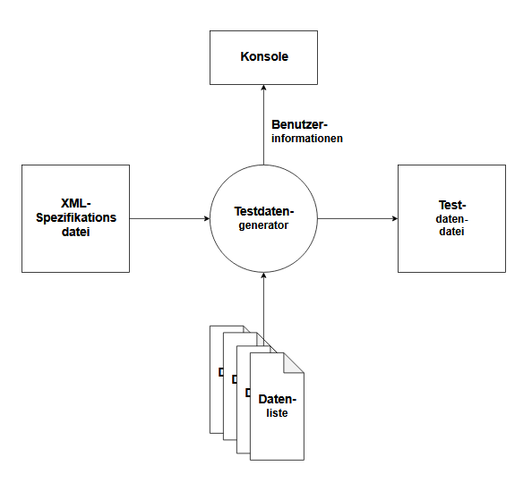

#  TdgSTB - Testdatengenerator 

Der Testdatengenerator TdgSTB erzeugt Testdatendateien. Gesteuert wird die Testdatengenerierung
durch eine XML-Spezifikationsdatei, welche am Skriptanfang eingelesen wird. Bei der Testdatengenerierung kann auf mitgelieferte oder vom Benutzer zusätzlich zur Verfügung gestellte Datenlisten zugegriffen werden.

## Requirements

Bei dem Testdatengenerator TdgSTB handelt es sich um ein einfaches PowerShell-Skript. Es sollte
auf jedem Windows-Rechner mit PowerShell laufen. Getestet wurde das Skript auf einem Windows 10 Rechner mit PowerShell V5.1.

Zur Konfiguration und Nutzung sind einfache PowerShell und XML-Kenntnisse notwendig.

## Installation

Zum Arbeiten mit dem Testdatengenerator TdgSTB ist keine spezielle Installation erforderlich.
Es reicht, wenn Sie die Dateien in ein Verzeichnis kopieren. Kontrollieren Sie, dass folgende Dateien anschließend auf alle Fälle vorhanden sind:
- `testdatengenstb.ps1` - PowerShellskript zur Generierung der Testdatendatei
- `xxx.xml` - XML-Spezifikationsdateien zur Steuerung der Testdatengenerierung
- `Datxxx.txt` - Datenlisten

## Usage

### XML-Spezifikationsdatei vorbereiten

Bei der Erstellung eigener XML-Spezifikationsdateien können Sie sich an den mitgelieferten Beispielen orientieren.

Hier einige Hinweise zum Verständnis der XML-Struktur:
- Im XML-Tag `filespec` legen Sie Namen der zu erzeugenden Testdatendatei fest.
- Im XML-Tag `rowcount` legen Sie fest, wie viele Testdatensätze erzeugt werden sollen.
- Im XML-Tag `delimiterspec` legen Sie fest, welches Spaltentrennzeichen in der Testdatendatei benutzt soll.
- Im XML-Tag `colspec` legen Sie fest, welche Spalten es gibt. Es kann beliebig viele Spalten geben. Die Spalten werden in der Reihnenfolge der Spezifikation erstellt. 
Pro Spalte gibt es ein XML-Tag `col`.
- Im XML-Tag `colname` wird der Spaltenname festgelegt. Dieser wird auch in der Kopfzeile der generierten Testdatendatei verwendet. Eine Ausnahme hiervon ist es, wenn die Datenliste eine
Mehrspaltendatei ist.
- Im XML-Tag `coltype` wird die Art der Spaltengenerierung festgelegt. Die möglichen Werte sind weiter unten aufgelistet.
- Im XML-Tag `colfile` wird die benötigte Datenliste festgelegt. Bei den Datenlisten handelt es sich um einfache Textdateien.
- Wird mit einer Mehrspaltendatei als Datenliste gearbeitet, so kann mit dem XML-Tag `detailcolname` auf die jeweilige Spalte verwiesen werden. 

Bei den **Datenlisten** gibt es zwei Arten von Dateien:
- **Einspaltendateien** - Diese bestehen nur aus einer Spalte. Es gibt keine Überschrift in der Datenliste. Die Spaltenüberschrift wird in der XML-Spezifikationsdatei selber festgelegt.
- **Mehrspaltendatei** - Diese bestehen aus mehreren Spalten, welche durch ";" getrennt sind. In der
Datenlistendatei gibt es Überschriften, welche genutzt werden.

Bei der Festlegung der **Spaltentypen** gibt es folgende Möglichkeiten:
- **1** - Fortlaufende Nummer; keine Datenliste notwendig.
- **2** - Zufallszahl; keine Datenliste notwendig; die Zufallszahl ist eine ganze Zahl zwischen 1 und 200
- **3** - Wert einer Einspaltendatei in zufälliger Reihenfolge.
- **4** - Wert einer Einspaltendaten in der vorgegebenen Reihenfolge; wenn das Ende der Datenliste erreicht ist, wird wieder von vorne angefangen.
- **5** - Werte einer Mehrspaltendatei in zufälliger Reihenfolge. Für alle Unterspalten der Mehrspaltendatei wird der gleiche Zufallswert benutzt.

### PowerShell Skript anpassen

Im Konfigurationsteil des Skripts gibt es zwei Variablen, die angepasst werden müssen:
- `$datenVerzeichnis` - Hier soll auf das Arbeitsverzeichnis des Testdatengenerators verwiesen werden. In dem Arbeitsverzeichnis befindet sich das PowerShell-Skript selber, die XML-Spezifikationsdatei und die Datenlisten.
- `$spezifikationsDatei` - Name der XML-Spezifikationsdatei.

Danach kann das PowerShell-Skript einfach gestartet werden. Während der Abarbeitung wird der Benutzer über den jeweiligen Arbeitsfortschritt informiert.

## Contribute

Es gibt mehrere Möglichkeiten zum Projekt TdgSTB beizutragen:
- Benutzen Sie TdgSTB und geben Sie Erfahrungen zurück. 
- Die Erstellung der Testdaten wird über XML-Spezifikationen und Datenlisten
gesteuert. Erstellen Sie eigene Datenlisten und XML-Spezifikationen zur Erzeugung interessanter Testdaten.

Ausbau des PowerShell-Skripts:
- Zusätzlicher Spaltentyp: Werte einer Mehrspaltendatei in vorgegebener Reihenfolge
- Spezifikation von Minimum und Maximum bei Zufallszahl
- Zusätzlicher Spaltentyp: Datums und oder Zeitstempel als Zufallswert mit Spezifikation von Minimum und Maximum
- Zusätzlicher Spaltentyp: Zeitreihe mit Startzeitpunkt, Intervall und Endzeitpunkt
- Zusätzlicher Spaltentyp: Emailadresse
- Zusätzlicher Spaltentyp: Telefonnummer

## Documentation

- README - Erster Überblick über das Projekt TdgSTB; diese lesen Sie gerade

## Version

V 0.1

## License

[MIT](LICENSE.txt) © [Markus Breuer].
